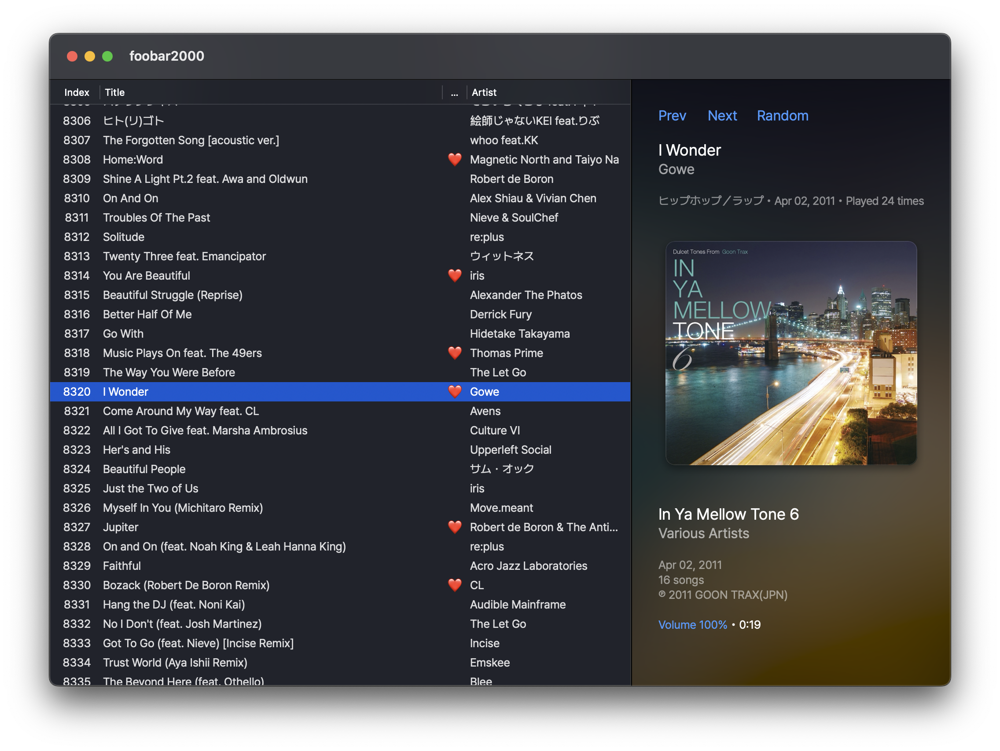

# foo_richtext_mac

A native `NSTextView` renders various information for playing or selected track, basically it is a replacement of [foo_textdisplay](https://www.foobar2000.org/components/view/foo_textdisplay) for macOS.

<details>
  <summary>Screenshot</summary>
  <br />
  
</details>

## Installation

Simply locate and add foo_richtext_mac.fb2k-component in foobar2000 mac.

> [!NOTE]
> Built and tested with `Xcode 16.4` and `macOS Sequoia 15.5`. Component is mostly built with AI tools.

## Usage

**View > Layout > Edit Layout...**

```
splitter vertical
 playlist font-name="Pretendard"
 richtext id=now padding=30 background=2 font-name="Pretendard Medium"
```

- `id` — the only instance identifier.
- `font-name` — assign default font name for a instance.
- `font-size` — assign font size for default font.
- `padding` - assign default padding value.
- `background` - `0` default background; `1` transparent background; `2` moving blurred background.

> [!NOTE]
> font-name with space needs to be wrapped with double quotes.
> e.g. `font-name="Noto Sans CJK JP Medium"`

## Scripting

| Directive | Purpose |
| ----------- | --------- |
| `//` | Comment lines |
| `$$`, `%%` | Escapes, `$$` shows `$` and `%%` shows `%`. |
| `[...]` | Title Formatting **conditional section** (e.g. `[%artist%]`). |
| `'text'` or `"text"` | **Quoted literal** content, rendered verbatim. Handy for printing special charaters. |
| `<dimmed>`, `<<more dimmed>>`, `>>>highlight<<<` | See [Dimmed and highlighted text](https://wiki.hydrogenaudio.org/index.php?title=Foobar2000:Title_Formatting_Reference#Dimmed_and_highlighted_text). |
| `$crlf([num])` | Adds num line(s) breaks at once. |
| `%field%` | `%title%`, `%artist%`, `%playback_time%` and etc. |
| `$function()` | `$ifgreater`, `$min`, `$progress` and etc. |
| `$font([name,size,weight,style])` | Style following contents on the line with provided font; `weight`:  **thin/light/regular/medium/semibold/bold/heavy/black**; `style`: **normal/italic/oblique**; `$font()` reset to panel default font. |
| `$rgb([r,g,b])` | Style following contents on the line with provided RGB color, Hex code is acceptable, e.g. `#FF0436`, `FF0436` or `F00`; `$rgb()` reset to panel default color. |
| `$image(type,shadow)` | aspect-fit center; grayscaled while paused; `type`: **front/back/artist/disc**; optional boolean(`true/false` or `1/0`) to adds a soft drop shadow. |
| `$cmd(path,label)` | Executes any main-menu/context-menu path by clicking the label text. |
| `$volume(int)` | Returns volume, `0` for dB value, `1` for percentage value. |

> Tag values starting with yyyy-mm-dd(usually date fields) display as e.g. `Jun 05, 2010`, trailing clock-time infomation (e.g. " 20:31", "T07:05:09.120+02:00") is dropped.

## Examples

### Play or Pause

```
$font(,16,semibold)$cmd(Playback/Play or Pause,$if(%ispaused%,Paused,$if(%isplaying%,Playing,Stopped)))
$crlf()

```

### Rating by star

```
$crlf(2)
$font(,16)$cmd($ifequal(%rating%,1,Playback Statistics/Rating/<not set>,Playback Statistics/Rating/1),$ifgreater(%rating%,0,★,☆))
$font(,16)$cmd($ifequal(%rating%,2,Playback Statistics/Rating/<not set>,Playback Statistics/Rating/2),$ifgreater(%rating%,1,★,☆))
$font(,16)$cmd($ifequal(%rating%,3,Playback Statistics/Rating/<not set>,Playback Statistics/Rating/3),$ifgreater(%rating%,2,★,☆))
$font(,16)$cmd($ifequal(%rating%,4,Playback Statistics/Rating/<not set>,Playback Statistics/Rating/4),$ifgreater(%rating%,3,★,☆))
$font(,16)$cmd($ifequal(%rating%,5,Playback Statistics/Rating/<not set>,Playback Statistics/Rating/5),$ifgreater(%rating%,4,★,☆))

```

### Rating by heart

```
$crlf(2)
$cmd($ifequal(%rating%,5,'Playback Statistics/Rating/<not set>','Playback Statistics/Rating/5'),$ifequal(%rating%,5,❤️,❤️‍🩹))

```

### Properties

```
$font(,,semibold)>>>Metadata<<<$crlf()
Artist Name$tab(2)%artist%$crlf()
Track Title$tab(2)%title%$crlf()
Album Title$tab(2)%album%$crlf()
Date$tab(3)%date%$crlf()
Genre$tab(3)%genre%$crlf()
Album Artist$tab(2)%album artist%$crlf()
Track Number$tab()%track number%$crlf()
Total Tracks$tab(2)%totaltracks%$crlf()
Disc Number$tab(2)%discnumber%$crlf()
Total Discs$tab(2)%totaldiscs%$crlf(2)

$font(,,semibold)>>>Location<<<$crlf()
File name$tab(2)%filename_ext%$crlf()
Folder name$tab(2)%directoryname%$crlf()
File path$tab(3)%path%$crlf()
Subsong index$tab()%subsong%$crlf()
File size$tab(3)%filesize_natural% '('%filesize%' bytes)'$crlf()
Last modified$tab(2)%last_modified%$crlf(2)

$font(,,semibold)>>>General<<<$crlf()
Duration$tab(3)%length_ex% '('%length_samples%' samples)'$crlf()
Sampele rate$tab(2)%samplerate% Hz$crlf()
Channels$tab(2)$info(channels)$crlf()
Bitrate$tab(3)%bitrate% kbps$crlf()
Codec$tab(3)%codec%$crlf()
Encoding$tab(2)$info(encoding)$crlf(2)

$font(,,semibold)>>>Other<<<$crlf()
Played$tab(3)%play_count% time$ifgreater(%play_count%,1,s,)$crlf()
First played$tab(2)%first_played%$crlf()
Last played$tab(2)%last_played%$crlf()
Added$tab(3)%added%$crlf()

```

## Interaction

- **Single-click** the artwork → `Playback/Play or Pause`.
- **Wheel** over the artwork → `Playback/Volume/Up` or `Playback/Volume/Down`.
- **Double-click** the safe/empty area → `View/Show Now Playing in Playlist`.
- **`←` / `→`** → `Playback/Seek/Back by 10 Seconds` or `Playback/Seek/Ahead by 10 Seconds`.
- **`cmd`+`n`** → `File/New Playlist`.
- **`cmd`+`w`** → `File/Remove Playlist`.
- **`cmd`+`p`** → `View/Playlist Manager`.
- **`cmd`+`u`** → `File/Add Location...`.
- **`cmd`+ `←` / `→`** → `File/Previous Playlist` or `File/Next Playlist`.
